<div align="center">


<br/>


<br/><br/>

<a href="https://github.com/commandleo-bot">

</a>

<a href="https://github.com/commandleo-bot?tab=repositories">

</a>

</div>

---

## ⚡ About Me

```yaml
name: Denny T Dileep
education: MCA
focus: Cloud & DevOps

cloud:
  - AWS

devops:
  - Linux
  - Docker
  - Kubernetes
  - Jenkins
  - Terraform
  - Ansible
  - Git & GitHub

currently:
  - Building hands-on DevOps projects
  - Practicing cloud infrastructure
  - Automating CI/CD workflows
  - Improving Linux and networking skills

mindset: "Learn → Build → Automate → Improve"
```

I’m an MCA graduate focused on **Cloud Computing and DevOps**, building practical experience through hands-on projects with AWS, Linux, containers, CI/CD, Infrastructure as Code, configuration management, and Kubernetes.

---

## 🛠️ DevOps Arsenal

<div align="center">


</div>

---

## 🚀 My DevOps Pipeline

<div align="center">

```text
        ┌─────────────┐
        │   GitHub    │
        │ Source Code │
        └──────┬──────┘
               │
               ▼
        ┌─────────────┐
        │   Jenkins   │
        │    CI/CD    │
        └──────┬──────┘
               │
               ▼
        ┌─────────────┐
        │    Docker   │
        │ Containers  │
        └──────┬──────┘
               │
               ▼
        ┌─────────────┐
        │ Kubernetes  │
        │ Orchestration│
        └──────┬──────┘
               │
               ▼
        ┌─────────────┐
        │     AWS     │
        │    Cloud    │
        └─────────────┘
```

</div>

---

## 🔥 Featured Projects

### 🔄 Jenkins CI/CD Pipeline
**Repository:** [week5-jenkins-demo](https://github.com/commandleo-bot/week5-jenkins-demo)

GitHub → Webhook → Jenkins → Pipeline → Validation → Build

**Stack:** `Jenkins` `GitHub` `Webhooks` `Pipeline` `CI/CD`

### ⚙️ Jenkins CI/CD Demo
**Repository:** [jenkins-cicd-demo](https://github.com/commandleo-bot/jenkins-cicd-demo)

Hands-on CI/CD automation and GitHub integration practice.

### 🐧 DevOps Linux Practice
**Repository:** [DevOps-Week-02](https://github.com/commandleo-bot/DevOps-Week-02)

Linux administration and DevOps fundamentals including commands, permissions, processes, networking, and shell practice.

---

## ☁️ DevOps Journey

```text
🐧 Linux
   ↓
🔧 Git & GitHub
   ↓
☁️ AWS
   ↓
🐳 Docker
   ↓
🔄 Jenkins / CI-CD
   ↓
🏗️ Terraform
   ↓
⚙️ Ansible
   ↓
☸️ Kubernetes
   ↓
🚀 Cloud & DevOps Engineering
```

---

## 📚 Currently Learning

| Area | Focus |
|---|---|
| ☁️ AWS | EC2, VPC, IAM, S3, Load Balancing |
| 🐧 Linux | Administration, permissions, services, networking |
| 🐳 Docker | Images, containers, Compose, networking |
| ☸️ Kubernetes | Pods, Deployments, Services, ConfigMaps, scaling |
| 🔄 Jenkins | Pipelines, webhooks, automated builds |
| 🏗️ Terraform | Infrastructure as Code, variables, state |
| ⚙️ Ansible | Inventory, playbooks, configuration automation |
| 🌐 Networking | DNS, DHCP, VPN, VLAN, TCP/IP |

---

## 📊 GitHub Analytics

<div align="center">





<br/><br/>


</div>

---

## 🐍 Contribution Snake

<div align="center">


</div>

---

## 🎯 2026 Goals

```text
✅ Linux Administration
✅ AWS Fundamentals
✅ Docker
✅ Jenkins CI/CD
✅ Terraform
✅ Ansible
✅ Kubernetes

⬜ End-to-End AWS DevOps Project
⬜ Production-Style CI/CD Pipeline
⬜ Python Automation
⬜ Open Source Contributions
⬜ More Cloud Infrastructure Projects
```

---

## 🧠 DevOps Philosophy

<div align="center">

### "Don't just run infrastructure. Automate it."

**Learn → Build → Break → Troubleshoot → Automate → Improve**

</div>

---

## 🤝 Connect

<div align="center">

<a href="https://github.com/commandleo-bot">

</a>

<!-- Add your LinkedIn here when ready -->

</div>

<br/>

<div align="center">

### ⭐ Thanks for visiting!

**Cloud ☁️ • Automation ⚙️ • Containers 🐳 • Kubernetes ☸️ • CI/CD 🔄**

</div>
